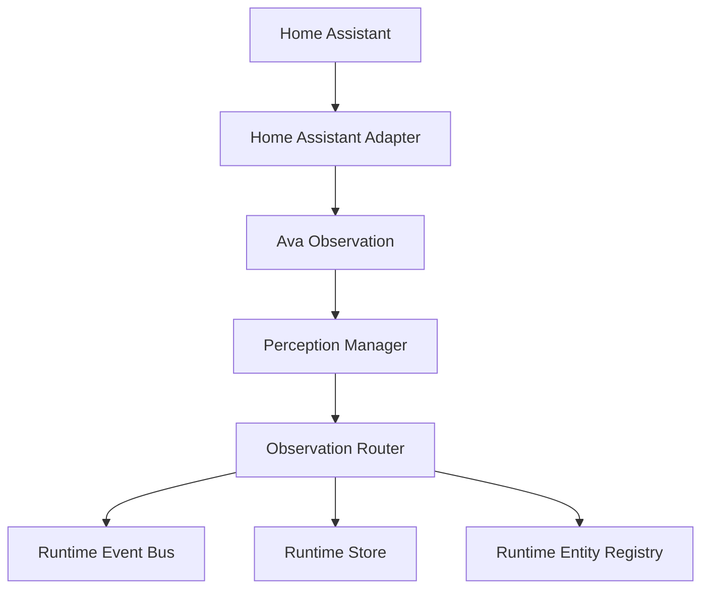

# Ava Home Assistant Adapter Phase 7A

## Architecture

The Home Assistant adapter remains a Perception Adapter. It does not write directly to Runtime Store, World Model, Cognitive Core, or Dashboard code. It produces normalized `AvaObservation` objects and lets the existing Perception Manager, Observation Router, Runtime Event Bus, Runtime Store, and Entity Registry handle routing.

## Connection Lifecycle

1. Read and validate `HOME_ASSISTANT_ENABLED`, `HOME_ASSISTANT_LOCAL_URL`, `HOME_ASSISTANT_WS_LOCAL`, `HOME_ASSISTANT_CONNECTION_MODE`, and `HOME_ASSISTANT_TOKEN`.
2. Bootstrap REST data using the bearer token.
3. Open the WebSocket connection.
4. Authenticate with the same token.
5. Download entity, device, and area registries through authenticated WebSocket commands.
6. Subscribe to `state_changed`.
7. Maintain heartbeat pings and connection health.
8. Reconnect with exponential backoff after disconnects or errors.

## REST Bootstrap

The adapter retrieves:

- `/api/config`
- `/api/states`

Initial Home Assistant states are converted into normalized bootstrap observations. Raw Home Assistant payloads are not published outside the adapter.

## WebSocket Lifecycle

The adapter connects to `HOME_ASSISTANT_WS_LOCAL`, handles `auth_required`, sends the token, waits for `auth_ok`, then loads registries and subscribes to `state_changed`.

Registry commands:

- `config/entity_registry/list`
- `config/device_registry/list`
- `config/area_registry/list`

## Observation Generation

Every bootstrap state and `state_changed` event becomes an `AvaObservation` containing sanitized metadata:

- `entity_id`
- `friendly_name`
- `domain`
- `device_class`
- `area`
- `state`
- selected safe attributes
- `last_changed`
- `last_updated`

The adapter never sends service calls, scripts, scenes, locks, lights, climate controls, notifications, camera streams, voice commands, or automation control.

## Failure Recovery

Supported failure modes:

- Missing or invalid configuration
- Invalid token
- DNS failure
- Connection refused
- REST timeout or non-200 response
- WebSocket authentication failure
- WebSocket disconnect
- Retry with exponential backoff

The Runtime continues operating if Home Assistant becomes unavailable. Adapter health reports connection state, authentication state, entity count, device count, area count, WebSocket latency, reconnect count, last event, last synchronization, connection duration, and events per minute.
