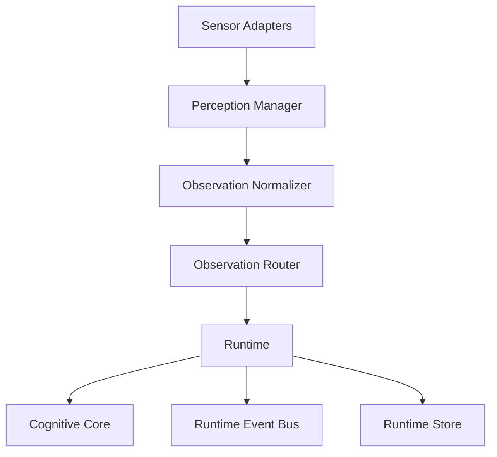
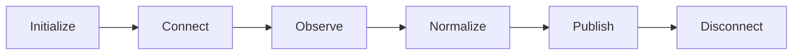
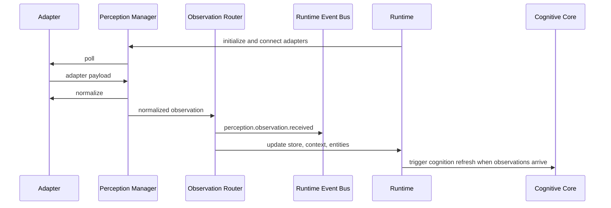

# Ava Perception Framework Phase 6

## Summary

Phase 6 adds `lib/ava/perception/` as Ava's universal perception framework. It separates data sources from perception so future systems can plug into sensor adapters, normalize observations, and route those observations into the runtime without coupling adapter-specific logic to the Cognitive Core.

Phase 6 created the perception framework with placeholders. Phase 7A replaces the Home Assistant placeholder with a read-only production adapter while the other non-Home Assistant adapters remain placeholders.

## Perception Architecture

## Adapter Lifecycle

## Runtime Flow

## Adapter Contract

Every adapter must implement `AvaSensorAdapter` from `lib/ava/perception/sensor.ts`:

- `initialize()`
- `connect()`
- `disconnect()`
- `health()`
- `capabilities()`
- `poll()`
- `subscribe()`
- `normalize()`

Adapters must return source-specific payloads from `poll()` and convert them into source-independent `AvaObservation` objects in `normalize()`.

## Placeholder Adapters

The default registry includes placeholders for:

- Home Assistant
- Camera
- Weather
- Calendar
- Vehicle
- Apple Devices
- Microphone
- Notifications

The Home Assistant adapter lives under `lib/ava/perception/adapters/homeassistant/` and now performs REST bootstrap plus authenticated WebSocket state streaming. It remains read-only and does not call services, scripts, scenes, or control devices.

## Extension Guide

1. Create a new adapter directory under `lib/ava/perception/adapters/<source>/`.
2. Implement `AvaSensorAdapter`.
3. Keep API credentials and live connection logic inside the adapter.
4. Normalize every payload into `AvaObservation`; do not publish source-specific objects into the runtime.
5. Register the adapter through `createDefaultPerceptionAdapters()` or pass it through `createAvaRuntime({ dependencies: { perceptionAdapters } })` in tests.
6. Add validation that proves initialize, connect, poll, normalize, route, and diagnostics behavior.

## Diagnostics

- `app/api/ava/perception` reports registered adapters, adapter health, observation statistics, observation counts, last observation, and runtime perception status.
- `app/runtime` shows registered adapters, adapter health, last observation time, observation counts, event throughput, connected adapters, and disabled adapters.
