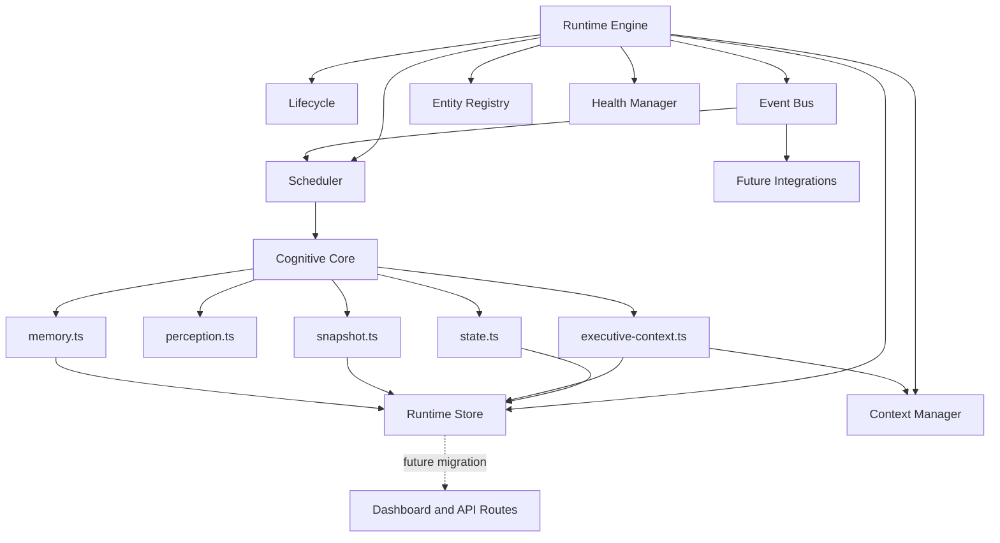
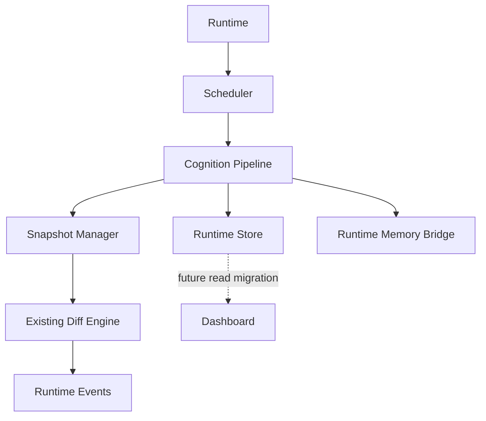
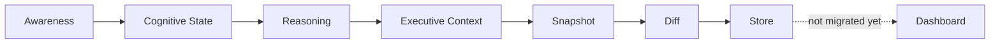
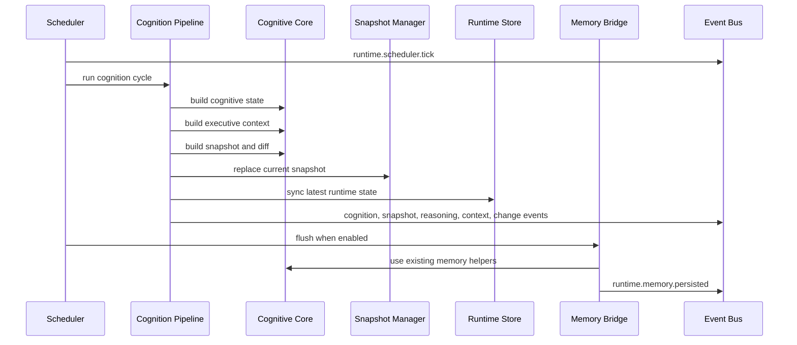

# Ava Runtime Foundation Phases 4-5

## Summary

Phase 4 adds `lib/ava/runtime/` as Ava's operating layer. Phase 5 connects that runtime to the Cognitive Core. The runtime now has explicit `request` and `continuous` modes so Vercel requests do not pretend to own an always-on process.

- `request` mode is the default. Each invocation performs one fresh cognition cycle and starts no scheduler, heartbeat, perception polling, or reconnect timers.
- `continuous` mode is opt-in for local development or a future durable worker. It owns scheduler, heartbeat, perception, and cleanup lifecycles.

The runtime is infrastructure only. It does not implement Home Assistant, voice, cameras, presence, notifications, Apple integrations, sensors, lighting, HVAC, security automation, WebSockets, or device discovery.

## Architecture

## Runtime Pipeline

## Runtime Data Flow

## Runtime Sequence

## Dependency Map

- Runtime Engine: coordinates startup, shutdown, heartbeat, scheduler, lifecycle, health, context, entities, event bus, and store.
- Cognition Pipeline: coordinates existing Cognitive Core modules for awareness, state, executive context, snapshot, diff, recommendations, focus, and status.
- Snapshot Manager: tracks current snapshot, previous snapshot, snapshot metadata, rollback, and snapshot age.
- Runtime Memory Bridge: persists snapshots, changes, and events through existing Cognitive Core memory helpers when enabled and configured.
- Scheduler: runs configurable recurring jobs for awareness refresh, executive context refresh, snapshot generation, optional memory persistence, cleanup, and health checks.
- Event Bus: accepts typed runtime events with priority, timestamp, source, origin, middleware, one-time handlers, and unsubscribe support.
- Runtime Store: keeps the latest in-memory awareness, timeline, world model, reasoning, attention, recommendations, focus plan, executive context, and snapshot.
- Context Manager: tracks current mission, focus, alerts, user, room, conversation, goals, executive context, and runtime status.
- Entity Registry: stores durable identities such as people, rooms, devices, vehicles, pets, projects, automations, and calendars. It is not the World Model and starts empty.
- Health Manager: reports uptime, runtime status, module health, integration health, scheduler latency, heartbeat latency, memory status, warnings, and errors.
- Cognitive Core: remains the source of cognition through `buildAvaCognitiveState()`, `perceiveAvaChanges()`, `getAvaExecutiveContext()`, `buildAvaSnapshot()`, and existing memory helpers.

## Runtime Flow

1. Runtime starts and transitions through `startup`, `initializing`, `ready`, then `idle`.
2. Heartbeat records runtime liveness and publishes `runtime.heartbeat`.
3. Scheduler runs configured jobs when explicitly started.
4. The cognition pipeline calls the existing Cognitive Core and produces the latest cognitive state, executive context, snapshot, and changes.
5. Snapshot Manager updates current and previous snapshots.
6. Runtime Store synchronizes the latest awareness, timeline, world model, reasoning, recommendations, focus, executive context, snapshot, changes, and runtime health.
7. Runtime events announce scheduler ticks, cognition completion, snapshot updates, reasoning updates, executive context updates, detected changes, memory persistence, diagnostics, and health changes.
8. Dashboard pages continue using existing request-built cognition until a future migration opts into runtime reads.

Request cognition collects awareness once and derives Cognitive State, Executive Context, snapshots, changes, focus, and recommendations from that same state. Runtime failures report health and always leave the lifecycle in `idle` unless the runtime is shutting down. Scheduler jobs cannot overlap with another execution of the same job.

## Future Extension Points

- Home Assistant, voice, presence, cameras, notifications, Apple devices, sensors, and n8n feedback should publish typed runtime events into the Event Bus.
- Environmental inputs should enter through `lib/ava/perception/` sensor adapters, normalize into source-independent observations, and route through the Perception Manager before reaching runtime.
- Integration modules should register persistent identities through the Entity Registry instead of inventing anonymous local objects.
- Runtime-aware dashboard routes should read from the Runtime Store only when the runtime is started and the data is fresh.
- Memory persistence remains optional and uses the existing `jarvis_memory` path when a Supabase client and owner ID are supplied.
- `app/api/ava/runtime` returns runtime status, uptime, heartbeat, scheduler status, snapshot age, mission status, focus, health summary, scheduler jobs, and diagnostics.
- `app/api/ava/perception` returns registered adapters, adapter health, observation statistics, observation counts, last observation, and perception status.
- `app/runtime` is an internal diagnostics dashboard for runtime state, scheduler, event bus activity, snapshot age, health, lifecycle, context, entities, and memory status.

## Migration Plan

1. Keep all existing dashboard pages and `/api/ava/*` routes request-driven during Phase 4.
2. Add runtime read fallbacks to Home and Daily Brief first, while preserving existing Cognitive Core calls when runtime state is unavailable.
3. Move Intelligence Feed to runtime-managed executive context after Home and Daily Brief are stable.
4. Migrate Tasks, Calendar, Projects, Automations, and Settings one surface at a time.
5. Connect assistant bootstrap context to runtime state only after dashboard parity is verified.
6. Add future integrations as event publishers, not direct dashboard or Cognitive Core writers.

## Verification

- `npx tsc --noEmit`
- `npm run lint`
- `npm run validate`
- `node scripts/validate-ava-runtime-foundation.js`
- Validation should end with `AVA_RUNTIME_FOUNDATION_OK` and `AVA_CONTINUOUS_COGNITION_OK`.
